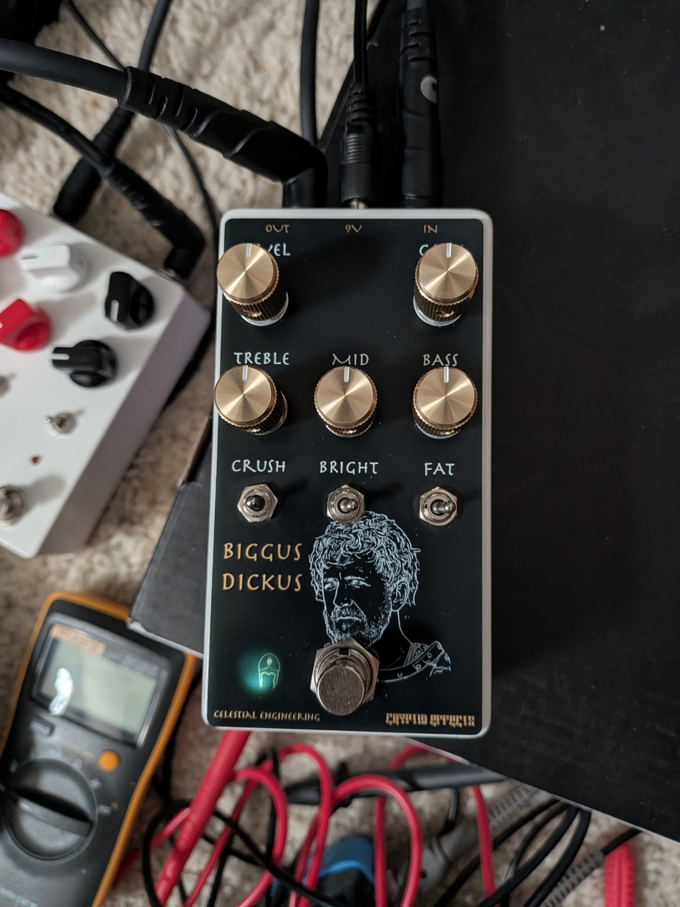
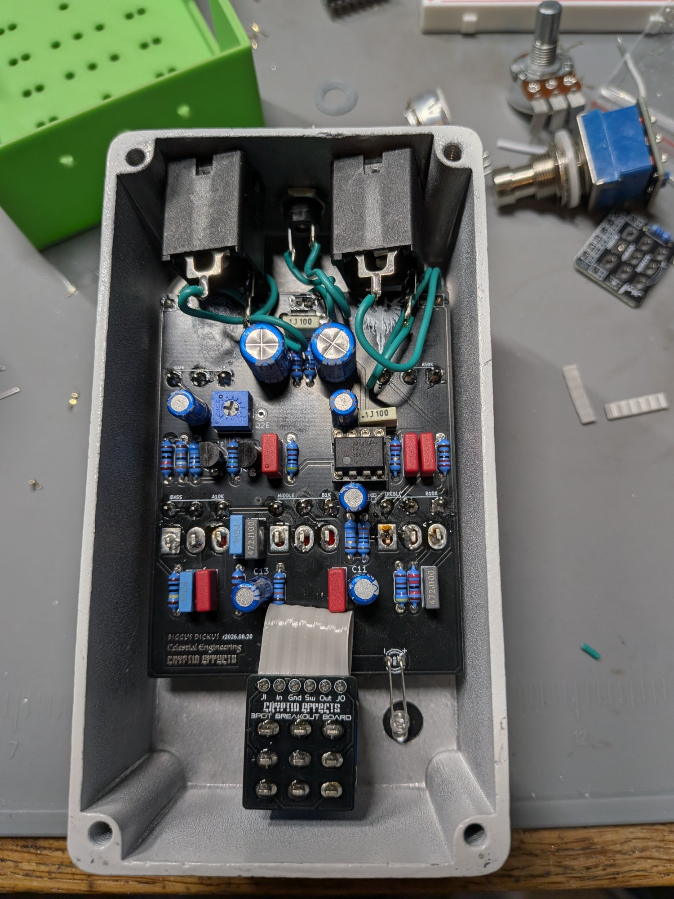
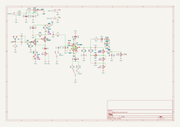
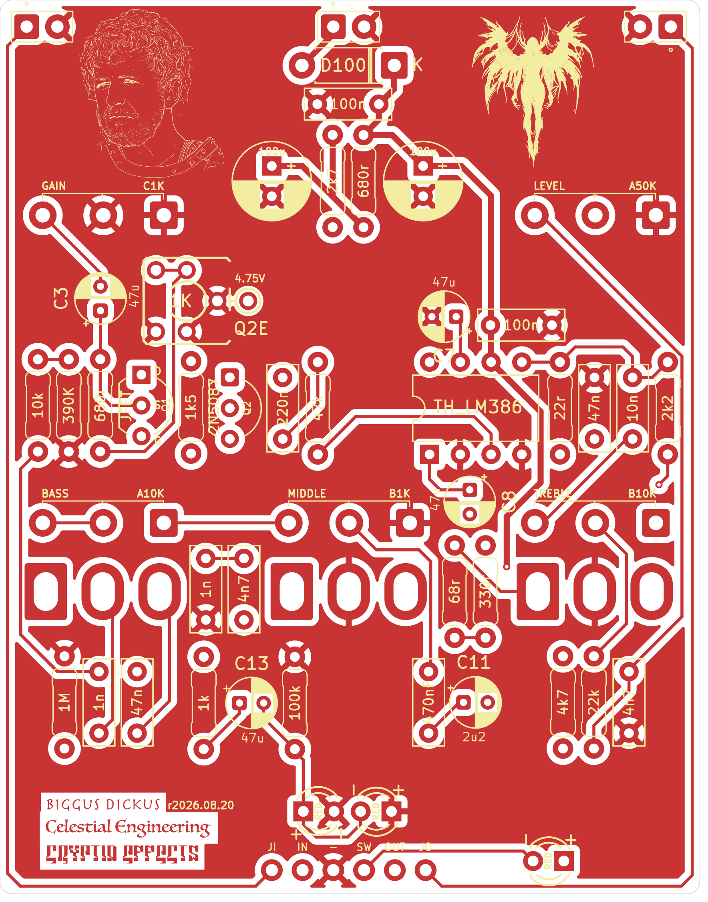
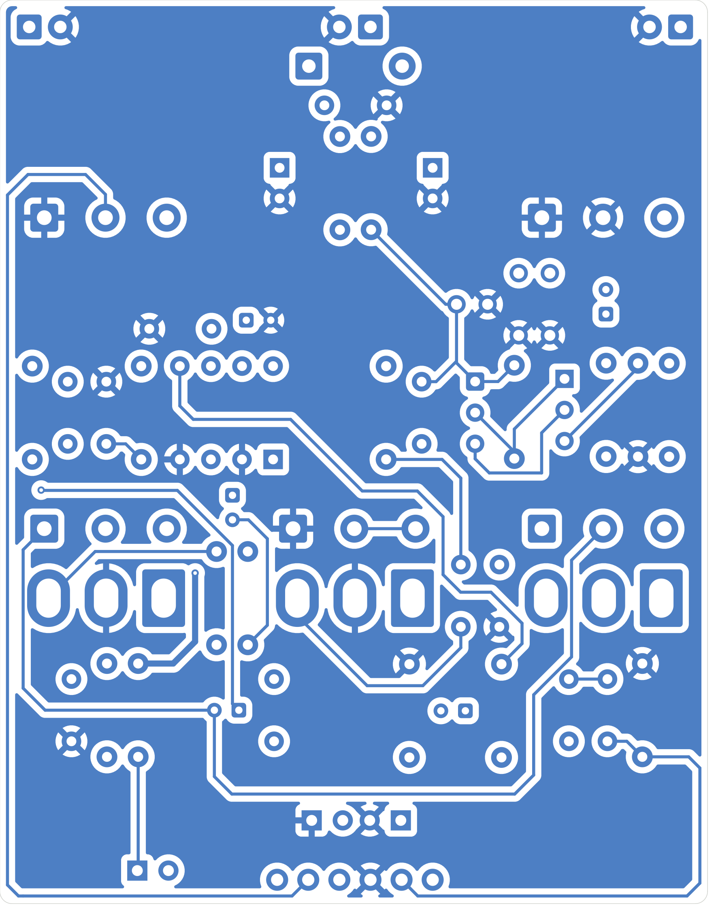
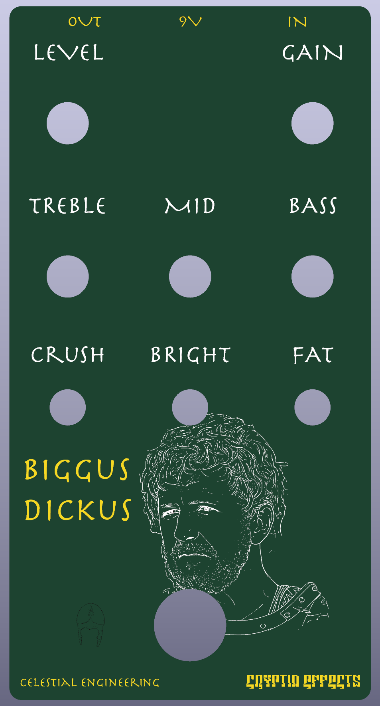

# Biggus Dickus
| Front | Guts |
|-------|------|
|  |  |

## Table of Contents
1. [Introduction](#introduction)
2. [Schematic](#schematic)
3. [PCB](#pcb)
4. [Faceplate](#faceplate)
5. [Tayda Drill Template](#tayda-drill-template)
6. [BOM](#bom)
7. [Notes](#notes)

## Introduction
**Biggus Dickus** is a PCB and faceplate for [Chuck D. Bones'](https://forum.pedalpcb.com/threads/another-dirt-pedal.4405/) infamous Biggus Dickus circuit, a dirt pedal loosely based on the Krank Distortus Maximus: a Sziklai pair (JFET and PNP) first stage driving an LM386 into a Marshall style treble / middle / bass tone stack. The circuit design is all Chuck's, I've only added a few things so I could dial it in like I'd like and fiddle with the bias a little bit. Yes, the eyes light up red when playing and the on indicator is a phallic shaped roman helmet. It also happens to sound amazing.

You can see the build report [here](https://forum.pedalpcb.com/threads/biggus-dickus.30289/).

### Controls

| Control | Type | Description |
|---------|------|-------------|
| Gain    | Pot  | Gain of the first stage |
| Treble  | Pot  | Tone stack treble |
| Mid     | Pot  | Tone stack middle |
| Bass    | Pot  | Tone stack bass |
| Level   | Pot  | Output volume |
| Fat     | Switch | Bass cut at the input |
| Bright  | Switch | Treble cut between the stages |
| Crush   | Switch (3 way) | Gain of the LM386 |

## Schematic

## PCB

| Front | Back |
|-------|------|
|  |  |

The back is shown as viewed from the back of the board, without the silkscreen artwork so the traces are visible.

Gerbers: [BiggusDickus_r2026-08-20-GERBER.zip](BiggusDickus_r2026-08-20-GERBER.zip)

## Faceplate

Gerbers: [BiggusDickus-Faceplate-r2026-08-20-GERBER.zip](BiggusDickus-Faceplate-r2026-08-20-GERBER.zip)

The render shows the default green solder mask, the one in the photos was ordered in black.

## Tayda Drill Template
The pedal is designed to use a 125B enclosure. Drill template: To Do

## BOM

### Resistors

| Component Name | Value | Note               |
|----------------|-------|--------------------|
| R1             | 1M    | Pull down resistor |
| R2             | 10k   |                    |
| R3             | 390k  |                    |
| R4             | 680R  | In series with RV1, sets the bias |
| R5             | 1k5   |                    |
| R6             | 2k7   |                    |
| R7             | 680R  |                    |
| R8             | 47k   |                    |
| R9             | 68R   | Crush switch       |
| R10            | 330R  | Crush switch       |
| R11            | 22R   |                    |
| R12            | 2k2   |                    |
| R13            | 1k    | Eye LEDs, can be omitted if you are not using them |
| R14            | 22k   |                    |
| R15            | 100k  | Eye LEDs           |
| R100           | 4k7   | Current limiting resistor, choose to taste |
| RV1            | 1k    | Trimmer, bias adjustment |

### Capacitors

| Component Name | Value | Note               |
|----------------|-------|--------------------|
| C1             | 1nF   | Film               |
| C2             | 47nF  | Film, Fat switch   |
| C3             | 47uF  | Electrolytic       |
| C4             | 220nF | Film               |
| C5             | 4n7   | Film, Bright switch |
| C6             | 1nF   | Film               |
| C7             | 47uF  | Electrolytic       |
| C8             | 47uF  | Electrolytic       |
| C9             | 47nF  | Film               |
| C10            | 10nF  | Film               |
| C11            | 2u2   | Electrolytic       |
| C12            | 470nF | Film               |
| C13            | 47uF  | Electrolytic, Eye LEDs, can be omitted if you are not using them |
| C14            | 4n7   | Film               |
| C100           | 100uF | Electrolytic       |
| C101           | 100nF | Film               |
| C102           | 100uF | Electrolytic       |
| C103           | 100nF | Film               |

### Diodes

| Component Name | Value   | Note               |
|----------------|---------|--------------------|
| D100           | 1N5817  |                    |
| D101           | LED 3mm | Status LED, choose your poison, 5mm works as well. |
| D102           | LED red | Eye LED            |
| D103           | LED red | Eye LED            |

### Transistors and ICs

| Component Name | Value   | Note               |
|----------------|---------|--------------------|
| Q1             | JFET    | Chuck's schematic calls for an MPF4393, he recommends a JFET with a Vp around -1V |
| Q2             | 2N5087  |                    |
| U3             | LM386   | Chuck used a JRC NJM386 in his final version |

### Potentiometers, Switches, Jacks, etc.

| Component Name | Value   | Note                 |
|----------------|---------|----------------------|
| VR1 - GAIN     | 1kC     | 16mm right angle pot |
| VR2 - TREBLE   | 10kB    | 16mm right angle pot |
| VR3 - MIDDLE   | 1kB     | 16mm right angle pot |
| VR4 - BASS     | 10kA    | 16mm right angle pot |
| VR5 - LEVEL    | 50kA    | 16mm right angle pot |
| U1 - FAT       | SPDT    | On / On              |
| U2 - BRIGHT    | SPDT    | On / On              |
| U4 - CRUSH     | SPDT    | On / Off / On        |
| J1 - POWER     | 2 pin header | To the DC jack  |
| J2 - JACK IN   | 2 pin header | To the input jack |
| J3 - JACK OUT  | 2 pin header | To the output jack |
| Footswitch     | 3PDT    |                      |
| audio jack x2  | mono    |                      |
| dc jack        | 9v      |                      |

## Notes

1. Biasing: adjust the RV1 trimmer until you read around 4.75V at the Q2E test point (the emitter of Q2). Chuck's notes say anywhere from 4.5V to 5.0V is fine. If you can't get there with the trimmer try a different JFET for Q1.
2. D102 and D103 are the eyes, they light up as you play. R13, R15, and C13 can be left off if you aren't using them.
3. If you use the faceplate, make sure you mount the LEDs directly against the PCB as they will get a stronger light.
4. The 3PDT foot switch connects to the row of pads at the bottom of the board (JI, IN, GND, SW, OUT, JO) and can be wired using a standard true-bypass wiring scheme or a 3PDT breakout board.

## Licensing

This layout is licensed with a Creative Commons BY-NC-SA 4.0 license (Attribution, Non-commercial, Share-alike). The Biggus Dickus circuit was designed by Chuck D. Bones.

## Versions
* **2026.08.20** - First public release after verification
