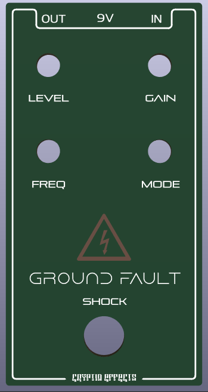
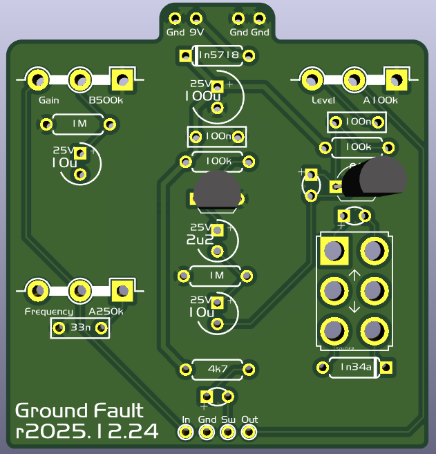
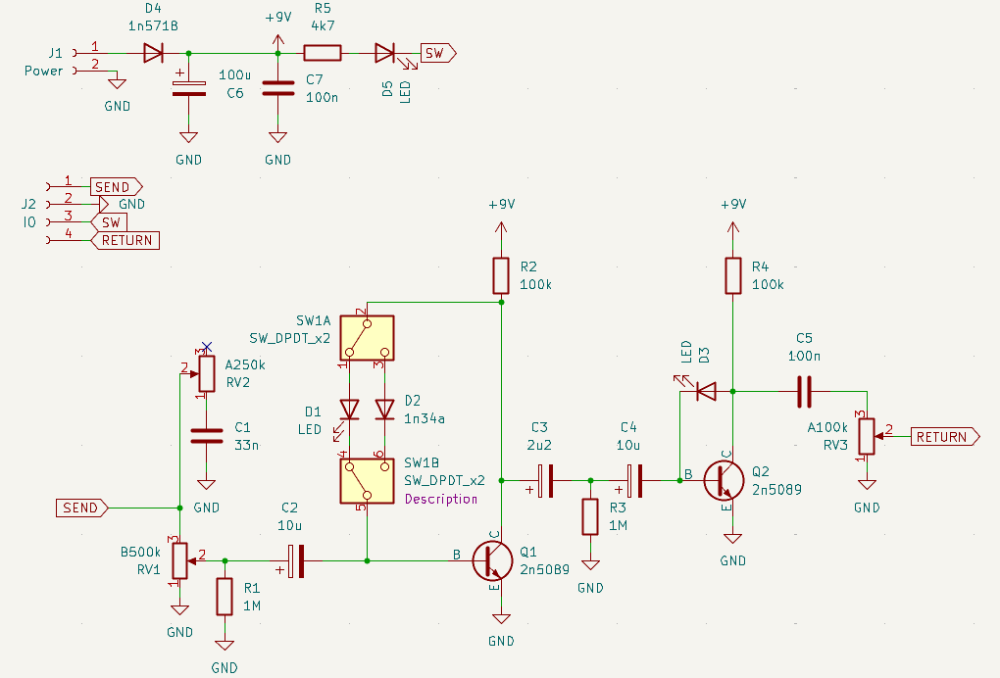

# Ground Fault
| Front | Guts |
|-------|------|
|  |  |

## Table of Contents
1. [Introduction](#introduction)
2. [Schematic](#schematic)
3. [PCB](#pcb)
4. [Faceplate](#faceplate)
5. [Tayda Drill Template](#tayda-drill-template)
6. [BOM](#bom)
7. [Notes](#notes)

## Introduction

Ground Swell is a clone of Fuzzhugger FX's [Arc Flash](https://www.youtube.com/watch?v=OBF0-cEVhbo) pedal that is, sadly, out of production. The [trace](https://forum.pedalpcb.com/threads/fuzzhugger-arc-flash.10081/post-361108) is from the user Almondcity on the PedalPCB forums. The only large changes I've made to the trace is more filtering on the DC input, otherwise it is exactly as presented in the trace.

## Schematic

## PCB

## Tayda Drill Template

## BOM

### Resistors

| Component Name | Value | Note               |
|----------------|-------|--------------------|
| R1             | 1M    | Pull down resistor |
| RLED1          | 1k    | Current limiting resistor, choose to taste |

### Capacitors

| Component Name | Value | Note               |
|----------------|-------|--------------------|
| C1             | 100nF | Film               |

### Diodes

| Component Name | Value   | Note               |
|----------------|---------|--------------------|
| D1             | LED 3mm | choose your poison, 5mm works as well. |
| D2             | 1N5817  |                    |

### Transistors

| Component Name | Value   | Note               |
|----------------|---------|--------------------|
| Q1             | 2N5089  |                    |
| Q2             | 2N5089  |                    |

### Potentiometers, Switches, Jacks, etc.

| Component Name | Value   | Note                 |
|----------------|---------|----------------------|
| GAIN           | 100kB   | 16mm right angle pot |
| FREQUENCY      | 100kB   | 16mm right angle pot |
| LEVEL          | 100kA   | 16mm right angle pot |
| MODE           | DPDT    | On / On              |
| Footswitch     | 3PDT    |                      |
| audio jack x2  | mono    |                      |
| dc jack        | 9v      |                      |

## Notes

## Licensing

This layout is licensed with a Creative Commons BY-NC-SA 4.0 license (Attribution, Non-commercial, Share-alike).
