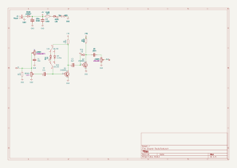
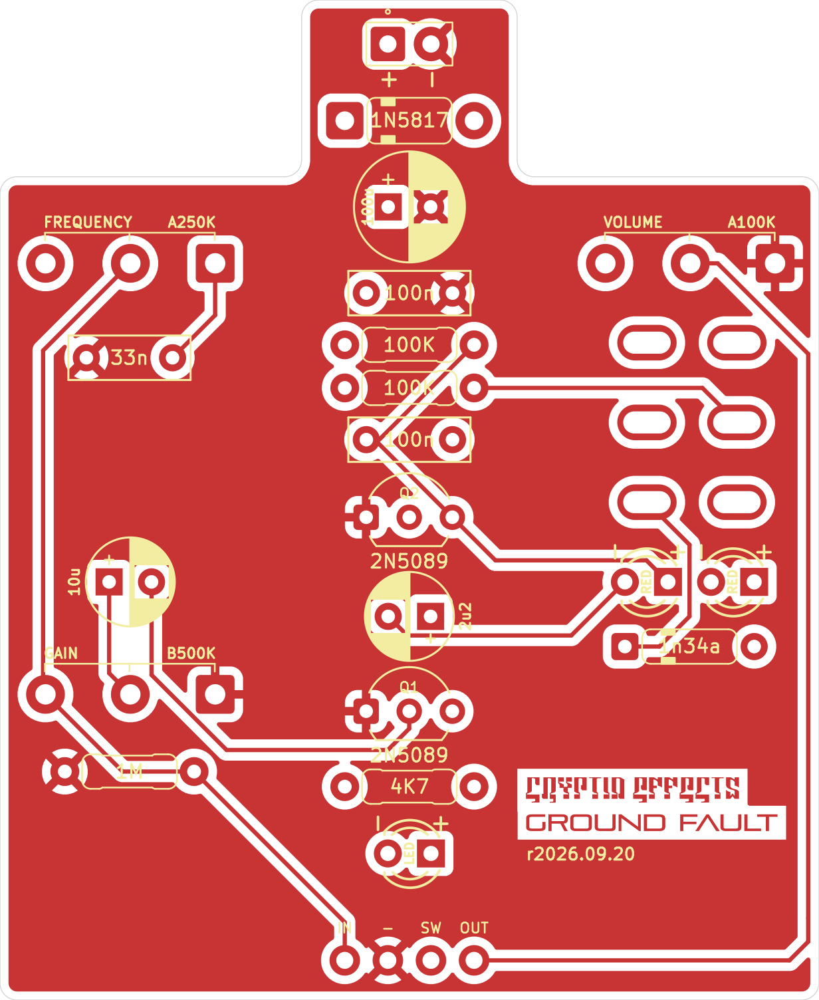
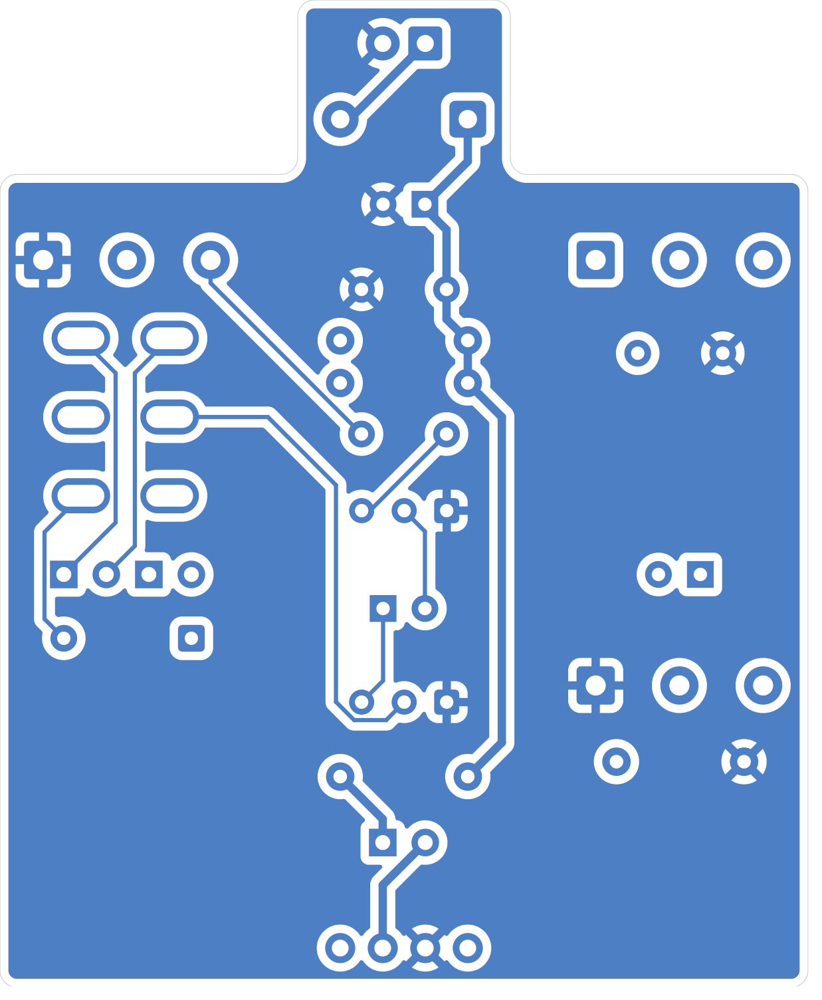
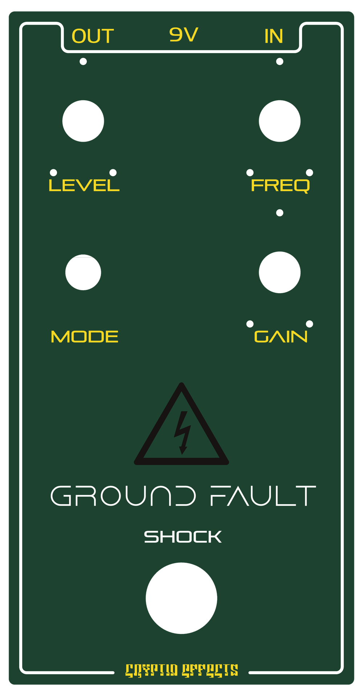

# Ground Fault
### Not Verified, all this can change

> [!NOTE]
> The layout was corrected on 2026.09.20. If you downloaded `GERBER-Ground-Fault.zip` before then, that layout is incorrect, please use the gerbers below instead.

| Front | Guts |
|-------|------|
| To Do | To Do |

## Table of Contents
1. [Introduction](#introduction)
2. [Schematic](#schematic)
3. [PCB](#pcb)
4. [Faceplate](#faceplate)
5. [Tayda Drill Template](#tayda-drill-template)
6. [BOM](#bom)
7. [Notes](#notes)

## Introduction

Ground Fault is a clone of Fuzzhugger FX's [Arc Flash](https://www.youtube.com/watch?v=OBF0-cEVhbo) pedal that is, sadly, out of production. The [trace](https://forum.pedalpcb.com/threads/fuzzhugger-arc-flash.10081/post-361108) is from the user Almondcity on the PedalPCB forums. The only large changes I've made to the trace is more filtering on the DC input, otherwise it is exactly as presented in the trace. You can learn a little bit more about the circuit [here](https://dirtboxlayouts.blogspot.com/2026/01/fuzzhugger-fx-arcflash.html) and [here](https://home-wrecker.com/bazz.html).

## Schematic

## PCB
**NOT VERIFIED**

| Front | Back |
|-------|------|
|  |  |

The back is shown as viewed from the back of the board.

Gerbers: [GERBER-Ground-Fault-r2026-09-20.zip](GERBER-Ground-Fault-r2026-09-20.zip)

## Faceplate

Gerbers: [GERBER-Ground-Fault-Faceplate-r2026-09-20.zip](GERBER-Ground-Fault-Faceplate-r2026-09-20.zip)

## Tayda Drill Template
The pedal is designed to use a 125B enclosure. You can use purchase an enclosure from Tayda and use the following template: [Ground Fault Drill Template](https://drill.taydakits.com/box-designs/new?public_key=VUFTUjk3Z09yUTNtdURocVpsd3NtZz09Cg==).

## BOM

### Resistors

| Component Name | Value | Note               |
|----------------|-------|--------------------|
| R1             | 1M    |  |
| R2             | 100k  |  |
| R3             | 100k  |  |
| R100           | 4k7   | Current limiting resistor, choose to taste |

### Capacitors

| Component Name | Value | Note               |
|----------------|-------|--------------------|
| C1             | 33nF  | Film               |
| C2             | 10u   | Electrolytic       |
| C3             | 2u2   | Electrolytic       |
| C5             | 100nF | Film               |
| C7             | 100nF | Film               |
| C100           | 100u  | Electrolytic       |

### Diodes

| Component Name | Value   | Note               |
|----------------|---------|--------------------|
| D1             | LED 5mm red | |
| D2             | 1N34A   |                    |
| D3             | LED 5mm red | |
| D100           | 1N5817  |                    |
| D101           | LED 3mm | Status LED, pick your poison |

### Transistors

| Component Name | Value   | Note               |
|----------------|---------|--------------------|
| Q1             | 2N5089  |                    |
| Q2             | 2N5089  |                    |

### Potentiometers, Switches, Jacks, etc.

| Component Name | Value   | Note                 |
|----------------|---------|----------------------|
| GAIN           | 500kB   | 16mm right angle pot |
| FREQUENCY      | 250kA   | 16mm right angle pot |
| VOLUME         | 100kA   | 16mm right angle pot, labeled LEVEL on the faceplate |
| U1 - MODE      | DPDT    | On / On              |
| J1 - POWER     | 2 pin header | To the DC jack  |
| Footswitch     | 3PDT    |                      |
| audio jack x2  | mono    |                      |
| dc jack        | 9v      |                      |

## Notes
1. There is a slight difference in the Arc Flash over time. My Arc Flash pedal has R1 connected to lug 3 of the GAIN pot then to ground as opposed to the trace from almondcity where it comes off lug 2 of the GAIN pot then to ground. I can't tell a difference between them. This layout has R1 on lug 3, the same as my pedal.
2. The 3PDT foot switch connects to the row of pads at the bottom of the board (IN, GND, SW, OUT). The input and output jacks are wired to the foot switch using a standard true-bypass wiring scheme.

## Licensing

This layout is licensed with a Creative Commons BY-NC-SA 4.0 license (Attribution, Non-commercial, Share-alike).

## Versions
* **2026.09.20** - Corrected layout and updated faceplate. Not yet verified.
