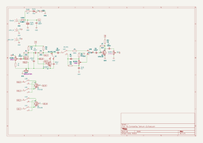
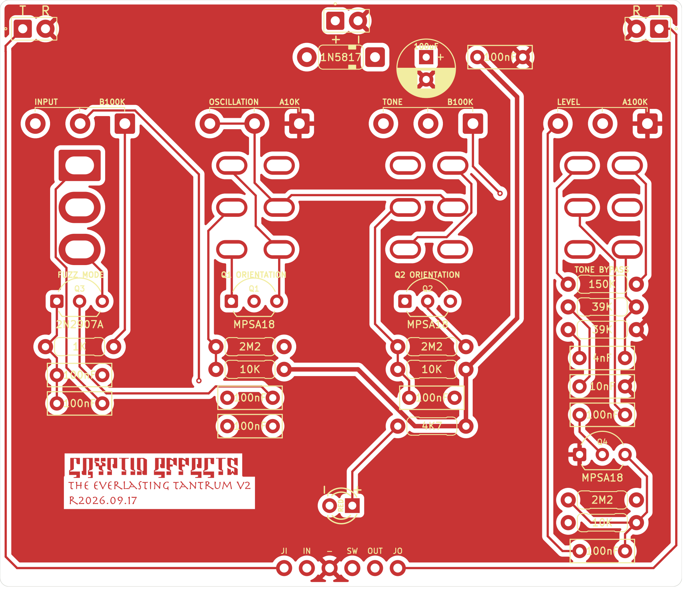
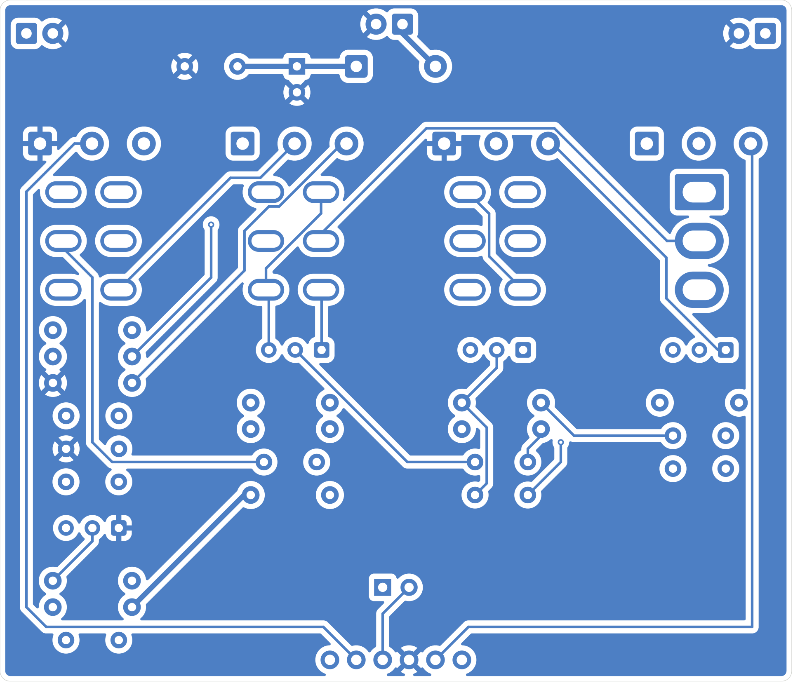
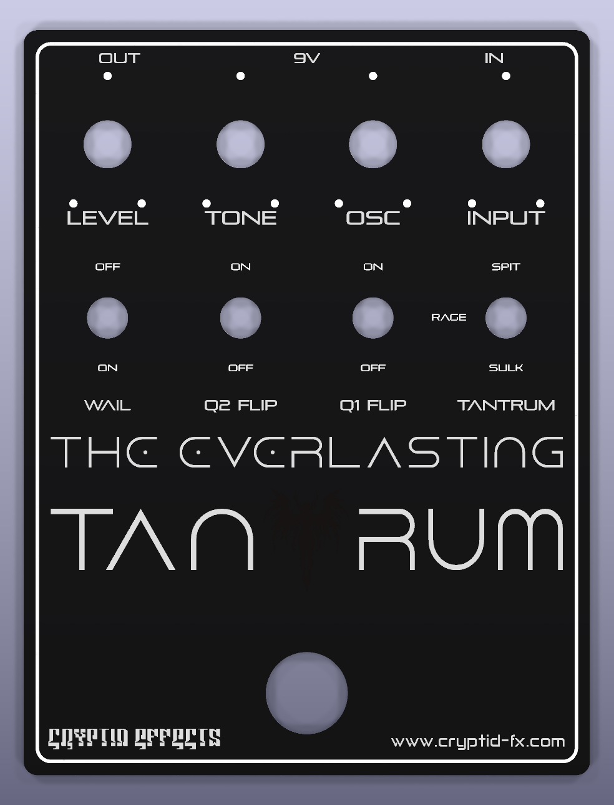
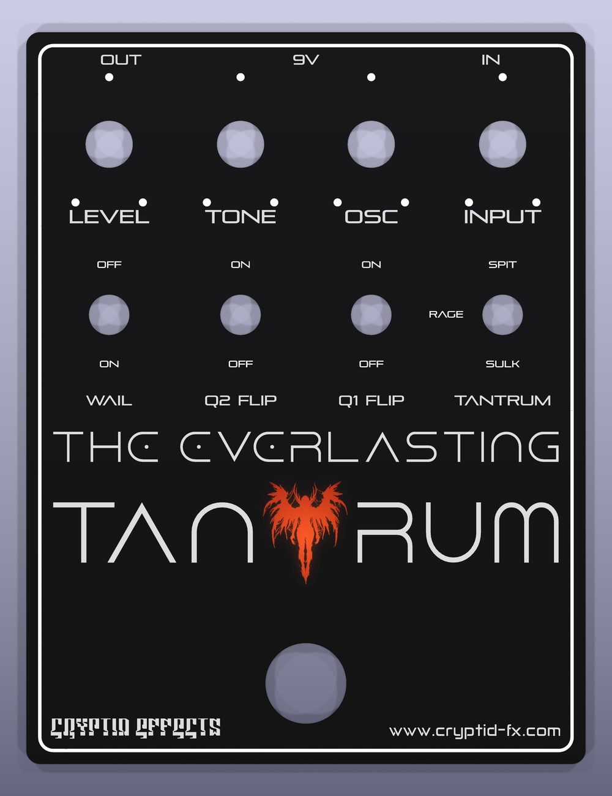
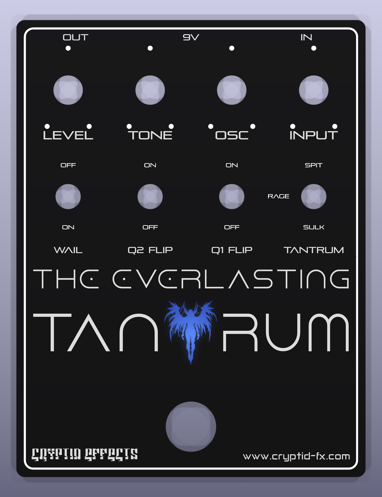

# The Everlasting Tantrum v2
### Not Verified, all this can change
| Front | Guts |
|-------|------|
| To Do | To Do |

## Table of Contents
1. [Introduction](#introduction)
2. [Schematic](#schematic)
3. [PCB](#pcb)
4. [Faceplate](#faceplate)
5. [Tayda Drill Template](#tayda-drill-template)
6. [BOM](#bom)
7. [Notes](#notes)

## Introduction
**The Everlasting Tantrum** is my take on an [unreleased fuzz pedal](https://forum.pedalpcb.com/threads/dod-grindhaus-fuzz%E2%80%94-the-mythical-unreleased-gem-of-the-cram-era.18194/) that was designed by DOD and Devi Ever. It was essentially a Hyperion followed by a Big Muff style tone stack and then a booster stage afterwards. I've augmented it with a switch to bypass the tone stack, another switch to allow you to choose between three different Devi Ever fuzzes, and an oscillation potentiometer that lets you introduce feedback into the fuzz circuit itself.

**v2** moves the pedal to a larger 1590BB enclosure with top mounted jacks and adds two new switches, **Q1 Flip** and **Q2 Flip**, that reverse the collector and emitter of the first two transistors for even more misbehaving fuzz textures.

### Controls

| Control | Type | Description |
|---------|------|-------------|
| Input   | Pot  | How hard you hit the fuzz |
| Osc     | Pot  | Introduces feedback into the fuzz circuit |
| Tone    | Pot  | Big Muff style tone control |
| Level   | Pot  | Output volume |
| Tantrum | Switch (Spit / Rage / Sulk) | Chooses between the three Devi Ever fuzzes |
| Q1 Flip | Switch (On / Off) | Reverses the collector and emitter of Q1 |
| Q2 Flip | Switch (On / Off) | Reverses the collector and emitter of Q2 |
| Wail    | Switch (On / Off) | Bypasses the tone stack |

## Schematic

## PCB
**NOT VERIFIED**

| Front | Back |
|-------|------|
|  |  |

The back is shown as viewed from the back of the board, without the silkscreen artwork so the traces are visible.

Gerbers: [TheEverlastingTantrum-v2_r2026-09-17-GERBER.zip](TheEverlastingTantrum-v2_r2026-09-17-GERBER.zip)

## Faceplate

Gerbers: [TheEverlastingTantrum-v2-Faceplate-r2026-09-17-GERBER.zip](TheEverlastingTantrum-v2-Faceplate-r2026-09-17-GERBER.zip)

The figure in the middle of the logo is lit from behind by the status LED:

| Red LED | Blue LED |
|---------|----------|
|  |  |

## Tayda Drill Template
The pedal is designed to use a 1590BB enclosure. Drill template: To Do

## BOM

### Resistors

| Component Name | Value | Note               |
|----------------|-------|--------------------|
| R1             | 1k    |                    |
| R2             | 2M2   |                    |
| R3             | 10k   |                    |
| R4             | 2M2   |                    |
| R5             | 10k   |                    |
| R6             | 150k  |                    |
| R7             | 2M2   |                    |
| R8             | 10k   |                    |
| R9             | 39k   | Big Muff Tone Stack|
| R10            | 39k   | Big Muff Tone Stack|
| R100           | 4k7   | Current limiting resistor, choose to taste |

### Capacitors

| Component Name | Value | Note               |
|----------------|-------|--------------------|
| C1             | 100nF | Film               |
| C2             | 100nF | Film               |
| C3             | 100nF | Film               |
| C4             | 100nF | Film               |
| C5             | 100nF | Film               |
| C6             | 100nF | Film               |
| C7             | 100nF | Film               |
| C8             | 4nF   | Film, Big Muff Tone Stack |
| C9             | 10nF  | Film, Big Muff Tone Stack |
| C100           | 100uF | Electrolytic       |
| C101           | 100nF | Film               |

### Diodes

| Component Name | Value   | Note               |
|----------------|---------|--------------------|
| D100           | 1N5817  |                    |
| D101           | LED 3mm | choose your poison, 5mm works as well. |

### Transistors

| Component Name | Value   | Note               |
|----------------|---------|--------------------|
| Q1             | MPSA18  |                    |
| Q2             | MPSA18  |                    |
| Q3             | 2N2907A |                    |
| Q4             | MPSA18  |                    |

### Potentiometers, Switches, Jacks, etc.

| Component Name        | Value   | Note                 |
|-----------------------|---------|----------------------|
| INPUT                 | 100kB   | 16mm right angle pot |
| OSCILLATION           | 10kA    | 16mm right angle pot |
| TONE                  | 100kB   | 16mm right angle pot |
| LEVEL                 | 100kA   | 16mm right angle pot |
| U1 - FUZZ MODE        | SPDT    | On / Off / On        |
| U2 - TONE BYPASS      | DPDT    | On / On              |
| U3 - Q1 ORIENTATION   | DPDT    | On / On              |
| U4 - Q2 ORIENTATION   | DPDT    | On / On              |
| J1 - POWER            | 2 pin header | To the DC jack  |
| J2 - JACK IN          | 2 pin header | To the input jack |
| J3 - JACK OUT         | 2 pin header | To the output jack |
| Footswitch            | 3PDT    |                      |
| audio jack x2         | mono    |                      |
| dc jack               | 9v      |                      |

## Notes

1. R9, R10, C8, and C9 make up the Big Muff style tone stack. You can modify these to taste and choose other Big Muff style tone stacks (Triangle, Green Russian, etc.)
2. If you use the faceplate, make sure you mount the LED directly against the PCB as it will get a stronger light.
3. The 3PDT foot switch connects to the row of pads at the bottom of the board (JI, IN, GND, SW, OUT, JO) and can be wired using a standard true-bypass wiring scheme or a 3PDT breakout board.

## Licensing

This layout is licensed with a Creative Commons BY-NC-SA 4.0 license (Attribution, Non-commercial, Share-alike).

## Versions
* **2026.09.17** - v2: 1590BB enclosure, top mounted jacks, Q1 and Q2 flip switches. Not yet verified.
